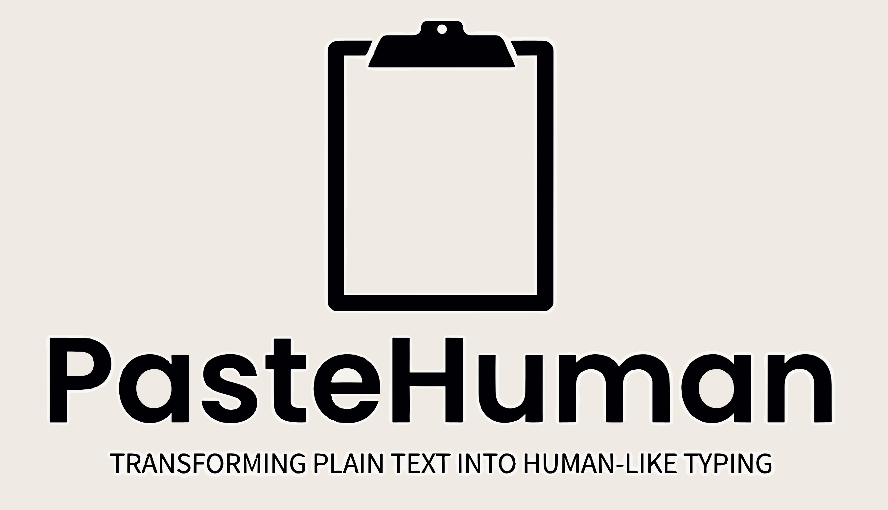

  

  <b>PasteHuman</b> is a Chrome extension that allows users to emulate typing in text input fields by pasting clipboard contents as if they were typed manually. It also gives users the ability to stop the emulation. Experience the magic of transforming plain text into human-like typing.

---

## 🌟 Features

- 📝 Emulate typing by pasting clipboard contents into text input fields.
- ⏹️ Ability to stop the emulation.
- 🕹️ Realistic typing emulation with random intervals between key presses.
- ⏳ Settings to adjust keystroke speed
- ⌨️⌨️ Hotkey support: Ctrl/Command+Shift+Y (default)

## 🛠️ Installation

Currently, this extension needs to be installed manually.

1. Clone this repository or download it as a ZIP and extract.
2. Open Chrome and go to `chrome://extensions/`.
3. Enable "Developer mode" (usually a toggle in the top-right corner).
4. Click on "Load unpacked" and select the directory where you extracted/cloned the extension.

## 🎯 How to use

1. Right-click on a text input field where you want to emulate typing.
2. Select "Emulate typing" from the context menu to start emulating typing with the contents of your clipboard.
3. If you want to stop the emulation before it completes, right-click again and select "Stop typing".

## 📂 Files

- `popup.html`: This is the HTML file for the extension's popup UI. It uses `popup.css` for styling. It displays the logo and some basic instructions on how to use the extension.
- `background.js`: This JavaScript file listens for the installation of the extension and creates context menu items (right-click menu items) for "Emulate typing" and "Stop typing". It also listens for context menu clicks and sends a message to the content script to perform the appropriate action.
- `content.js`: This is the content script. It listens for messages from `background.js` and performs the typing emulation. It uses a unique identifier for each typing session and uses timeouts to emulate the typing delay.
- `manifest.json`: This JSON file contains metadata about the extension such as its name, description, version, permissions, icons, and background scripts.
- `PasteHuman_Logo.jpeg`: This is the logo image for the extension, displayed in the popup UI.

## 🤝 Contribution

Feel free to contribute to this project by submitting issues or pull requests.

## 📜 License

Please add a license file in the root directory of the project if you have one. This will specify how others can use and contribute to your project.

## 📞 Contact

Please add contact information if you wish to provide a way for users to get in touch with you regarding the extension.

## Description
PasteHuman is a Chrome extension enabling users to paste text as if they're typing it out. It features an intuitive process, allowing the emulation of realistic human typing and giving users the ability to halt the typing simulation.

